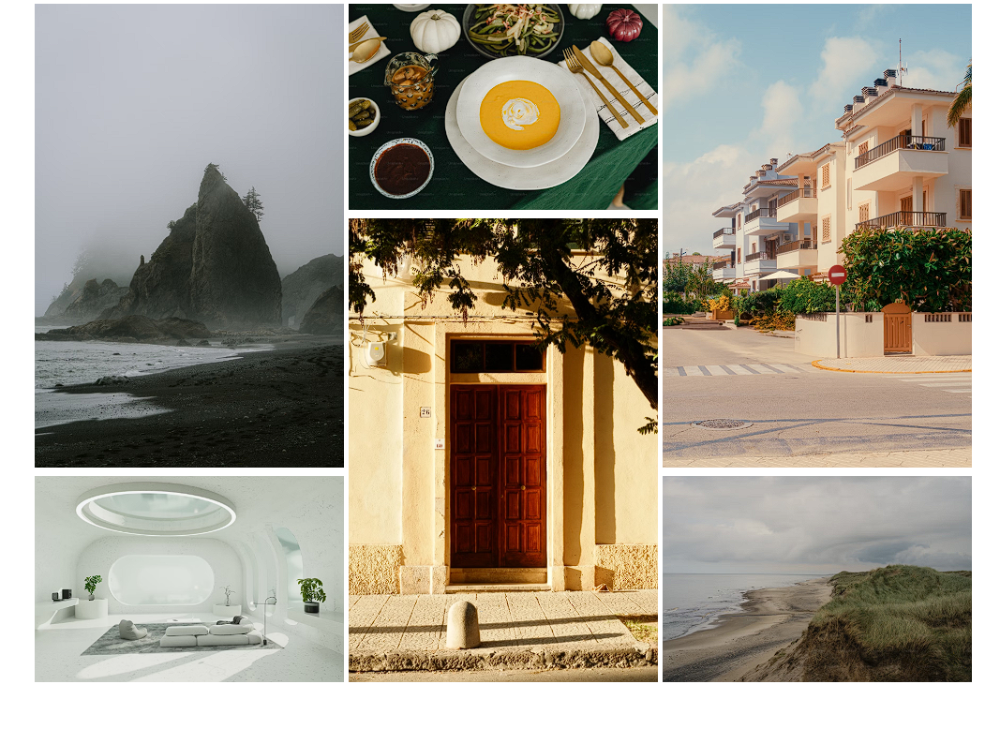
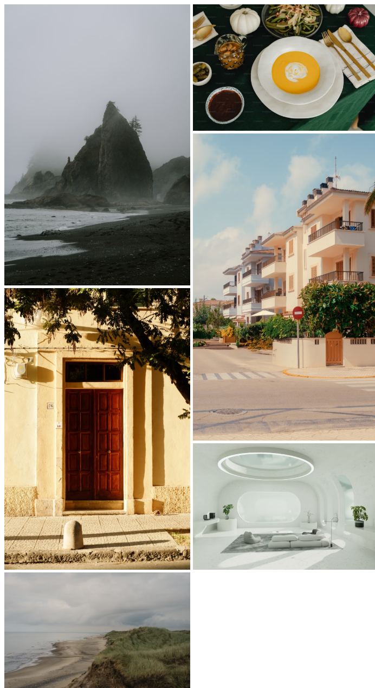
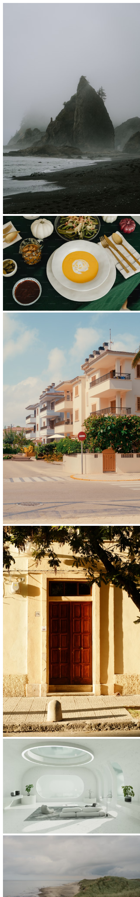

# Image Grid Layout

## HTML and CSS

## Description
- This project was build with HTML and CSS
- The motivation behind this project was to create an visually apealing photo collage
- This will help websites be more visually appealing
- While creating this project I improved my grid and media query skills

## Usage

- Click on the link to head over to the Project Repository https://github.com/0mar77/image-grid-layout
- Clone the repo
- Launch in local environment

## Project URL

https://roadmap.sh/projects/image-grid

